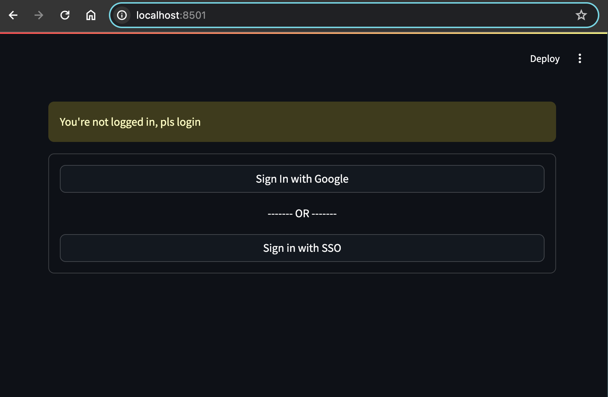

# Streamlit Authentication & SSO

## Description

This project is the completed Streamlit application for [Descope: Add Authentication and SSO to Your Streamlit App](). It uses the [Descope Python SDK](https://github.com/descope/python-sdk) to communicate with the Descope API.



## Getting Started

### Prerequisites

To run this project locally, you will need to have the following:

- **[Python 3](https://www.python.org/downloads/)** with a basic understanding of it.
- The [**Git CLI** installed](https://git-scm.com/book/en/v2/Getting-Started-Installing-Git) on your local machine.
- A free [**Descope** account](https://www.descope.com/sign-up).

### Running the Project Locally

Having met all the prerequisites, you follow the steps below to run the project locally.

1. Clone the repo:

```sh
git clone git@github.com:iamgideonidoko/streamlit-auth-sso.git
cd streamlit-auth-sso
```

2. Create and activate a virtual environment (optional but recommended);

```sh
.\env\Scripts\activate # Windows
source env/bin/activate # macOS & Linux
```

3. Install the dependencies:

```sh
pip install -r requirements.txt
```

4. Create secret file (`.streamlit/secrets.toml`)

```sh
cp ./.streamlit/secrets.toml.example ./.streamlit/secrets.toml
```

5. Update secret file with your Descope project and tenant IDs

```
DESCOPE_PROJECT_ID = "xxxxxxxxxxxx"
DESCOPE_TENANT_ID = "xxxxxxxxxxxx"
```

6. Run the app:

```sh
python app.py
```
